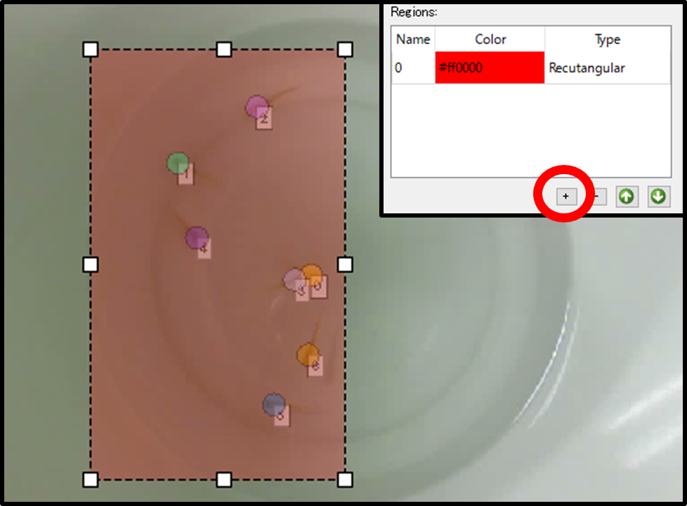
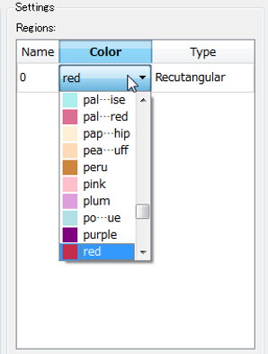
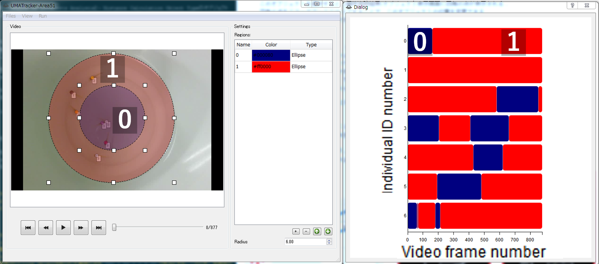

# UMATracker Quick Start Guide
## Summary
**UMATracker** is the animal tracking software.

**UMATracker** consists of

* **UMATracker-FilterGenerator**
* **UMATracker-Tracking**
* **UMATracker-TrackingCorrector**
* **UMATracker-Area51**

It is possible to perform the video pre-processing, the individual animal tracking, the result correction and the analysis of tracking results.

### UMATracker Can Do
* Video pre-processing by visual programming. (**UMATracker-FilterGenerator**)
* Individual animal tracking that number of individuals is constant. (**UMATracker-Tracking**)
* Skeleton, shape and orientation estimation. (**UMATracker-Tracking**)
* Tracking result correction. (**UMATracker-TrackingCorrector**)
* Tracking result analysis such as Region-Of-Interest, inter-individual interaction, etc. (**UMATracker-Area51**)

### UMATracker Cannot Do (Currently)
* Individual animal tracking that number of individuals increase or decrease while tracking.
* Individual animal tracking that you can not extract individuals by video pre-processing with **UMATracker-FilterGenerator**.

In this Quick Start Guide, we explain how to use the individual animal tracking and its analysis.

## Basic Workflow


Individual animal tracking by **UMATracker** can do by the following workflow.

1. **UMATracker-FilterGenerator**: Create a filter for the video pre-processing.
2. **UMATracker-Tracking**: Perform individual tracking using a filter that you created in the **UMATracker-FilterGenerator**.
3. **UMATracker-TrackingCorrector** Correct the individual tracking results obtained with **UMATracker-Tracking**.
4. **UMATracker-Area51** Analyse the tracking result.


## UMATracker-FilterGenerator
It is possible to improve the accuracy of the individual tracking by creating the video pre-processing filter.
At first, use **UMATracker-FilterGenerator** to create an image filter by visual programming.

### FilterGenerator Window
The following shows the name and description of each part of the screen **UMATracker-FilterGenerator**.


1. Filter tool tip
	
	The tool-tip which lists available blocks.
	We can place a block on Canvas by drag-and-drop.

2. Filter block
	
	Image filter is assigned to each block. The union of blocks represents the image filter.

3. Canvas
	
	The filter blocks are placed. We can create the image filter as desired by joining blocks on here.

4. Input screen
	
	Input video image is displayed.

5. Output screen
	
	The result image of adaptation of the filter represented on Canvas is displayed.

6. Background generation menu
	
	Extract the background image from the input video.

### Filter Block Operation
Now we create the image filter by combining the block on Canvas.
In this section, we explain how to operate the block.

#### Initial Block State


At the time of start-up, only `Output` block and `Input` is displayed on Canvas.
`Input` points to the input image displayed.

The data of the connected to `Output` block is displayed in the "Output screen" described above.
The blocks sandwiched between `Input` and `Output` represents the image filter.
In this example, since `Input` block is connected directly to the `Output` block, Output screen shows the image which is displayed on Input screen.

#### Add Block
To insert a block into the block group on Canvas, drag-and-drop it from the filter tool tip to the block group.


```eval_rst
.. note:: It is possible to insert a block by right-clicking while focusing on the filter tool chip.
```

For example, if you insert a `BGRToGray` in the filter tool chip `Filters`, "output screen" is changed to gray scale of "input screen".
This means `BGRToGray` is the gray-scale filter.


At this time,

1. `Input` block passes the image which is displayed on Input screen to `BGRToGray` block.
2. `BGRToGray` block converts the image passed from `Input` block and passes the processed image to `Output` block.
3. `Output` block receives the image from `BGRToGray` block.
4. Then, the image which is received by `Output` block is displayed on Output screen.

#### Remove Block
To delete a block that is no longer needed, drag-and-drop the blocks to the "Filter tool tip" or the Trash on Canvas.

```eval_rst
.. warning:: If the block and another block is away or there is unused block, an error will occur and the output is not reflected to Output screen.

    .. list-table:: Error Examples
        :header-rows: 1

        * - Blocks
          - Description
        * - .. image:: img/quick/uma_filtergenerator_disconnectedoutputblock.png
          - If the block and another block is away.
        * - .. image:: img/quick/uma_filtergenerator_unusedblock.png
          - If there is unused block.
```

#### Block Types
Block can be divided into three types on whether there are Inputs/Output.

**The block which has Inputs/Output means the specific image filter. The block converts the image from Inputs into Output by the image filter which is assigned to itself.**

```eval_rst
.. list-table:: Block I/O Types
    :header-rows: 1

    * - Block Example
      - Type
      - Description
    * - .. image:: img/quick/uma_filtergenerator_inputonlyblock.png
      - Input block
      - Block that accepts Inputs only.
    * - .. image:: img/quick/uma_filtergenerator_inputoutputblock.png
      - Inputs/Output block
      - Block which has both Inputs and Output.
    * - .. image:: img/quick/uma_filtergenerator_outputonlyblock.png
      - Output block
      - Block with the only output.
```

### How to Make your own Filter

In **UMATracker-FilterGenerator**, the goal is to create a filter which makes the location of the animal you want to track white and other locations black.In the figure above, it can be seen that regions that ants exist turned white.
For that purpose, it is necessary the following procedure.

1. Gray-scale transformation
2. Binarization
3. Removal of unwanted areas in the analysis
4. Noise removal

These process can be enough to individual tracking if there is sufficient contrast difference between animals and its background. If not, there are the additional options.

1. Removal of background
2. Extraction of the object to be tracked by color selection


```eval_rst
.. youtube:: https://www.youtube.com/watch?v=PEWX8cctaSQ
```

#### Open the Video File
Select the `Files / Open Video File` from the menu, or drag-and-drop the video file to the window.

```eval_rst
.. warning:: If the file size is large (GB unit), or there is a case in which a long period of time of the video (15 minutes or more), the software of the operation becomes slow. In such case, it is resolved by splitting the video or encoding video into the small size in advance.
```

#### Generate Background

To do background removal, select `Background / Create Background` from the menu. Then, the background generation dialog is shown.


First, specify the start and end points of the video to be used in the background generation.
Move the slider to select the starting point of the video to be used in the background generation and click the Set Min button.
Then, the color of the slider bar after starting point is changed to red.
Similarly, by moving the slider, select the end point of the video to be used in the background generation and click the Set Max button
End point the color of the previous slider bar becomes red.
The red interval of the video slider bar is used in the background generation.
```eval_rst
.. note:: For correct background generation, it is necessary that the background is static (contrast and viewpoint does not change).By specifying the start and end points of the video for the background generation, we can excluding the portion of the video which we do not want to use the background generation.
```

Then, specify the video frame interval to use for the analysis into the Frame delta spin box.

Background generation is started by pressing the Generate button.
After the background generation ends, the result image which have been background removal is shown in the right side of the view. Check whether you are successful in the background removal by moving the slider.

```eval_rst
.. warning:: The background generation can be more stable if the large number of frames to be used, but it takes more time. In such case, adjust start and end points and the Frame Delta.
```


```eval_rst
.. youtube:: https://www.youtube.com/watch?v=za1jzU0K56k
```

#### Color Filtering
If the animal has color marker or the characteristic color, it is possible to extract the animal by extracting the specific color.

```eval_rst
.. list-table:: ColorFilter
    :header-rows: 1

    * - Block
      - Description
    * - .. image:: img/quick/uma_filtergenerator_colorfilter.png
      - Select a color by the color palette in the right side of the block and adjust the degree of similarity in number input field.
```

`Color Filter` is included in the `Filters` tool tip.
If you click the red portion of the block, the color palette appears. Then, select the color you want to extract.
Numerical input field on the right side of block represents the similarity of colors.


```eval_rst
.. note:: While selecting ColorFilter block on Canvas, it is also possible to select a color by clicking the part to be extracted on "Input screen".
```

```eval_rst
.. youtube:: https://www.youtube.com/watch?v=3ktUtdCrQzk
```

#### Convert to Gray Scale

In order to create a filter that only object of the region where you want to track is made white, there is a need to be converted to gray scale image that each pixel have a value between 0 and 255.
To convert a color image into gray scale image, we use `BGRToGray` block in `Filter` tooltip.

This is an example of applying a `BGRToGray` block into ants video after the background removal.


```eval_rst
.. warning:: Even if there is no change in the appearance, be sure to perform it before binarizing because it is essential work.
```

#### Binarize


Gray scale image is the image each pixel is in from 0 to 255. The pixel which value close to 0 represents the black, value close to 255 represents the white.
After the above gray scale conversion, the regions which you want to track have been bright gray color. We can reach the final goal of the image by converting them into white.

Image is binarized by `Threshold` block.
The binarization is to convert the gray scale image into a black and white two-tone image. Each pixel is converted to 255 (white) when its value is above the pre-defined threshold, otherwise 0 (black).

The right side of `Threshold` block is the numerical value input field for the threshold.

Applying `Threshold` block to the gray-scale ants video which mentioned above becomes as follow.


#### Exclude the Obstacle by the Region Selector

Unwanted areas in analysis affects the accuracy of the individual tracking.
Therefore remove the unwanted areas by selecting the area for analysis.

`UMATracker-FilterGenerator` has four types of region selection operator, `Poly Selection`, `Circular selection` and ` Rectangle selection` block.

```eval_rst
.. list-table:: Selection/Exclusion Blocks
    :header-rows: 1
    :widths: 2, 1, 5

    * - Block Example
      - Type
      - Description
    * - .. image:: img/quick/uma_filtergenerator_rectsel.png
      - Rectangle
      - .. image:: img/quick/uma_filtergenerator_rectselexample.png
    * - .. image:: img/quick/uma_filtergenerator_circsel.png
      - Ellipse
      - .. image:: img/quick/uma_filtergenerator_circselexample.png
    * - .. image:: img/quick/uma_filtergenerator_polysel.png
      - Polygon
      - .. image:: img/quick/uma_filtergenerator_polyselexample.png
```

The following image shows the applying `Circular selection` block to the ant video which were binarized above.
There are still remained edges of the petri dish on the left image. It has succeeded in extracting only in the dish by using `Circular selection` block on the right image.


```eval_rst
.. youtube:: https://www.youtube.com/watch?v=NRFRUSzR6xk
```

```eval_rst
.. youtube:: https://www.youtube.com/watch?v=fqht_bxmx3s
```

```eval_rst
.. note:: If you set the check box of each block off, the cut area is reversed.
```

#### Noise Reduction
The video images sometimes have noise.The cause of the noise is a variety, such as feces of animals, dusts, the illumination change or the movement of camera.By eliminating these noise as much as possible, it can be performed with high precision individual tracking.

The simplest noise removal is to use the `Erosion` block.
Erosion is that the filter as reduce the white areas. It is possible to remove smaller noises than the object to be tracked.


The following image shows an example of applying `Erosion` block to the ant video.


#### Save Filter Data
Filter data (extension `.filter`) is saved by selecting the `Files / Save Filter Data` from the menu.
```eval_rst
.. warning:: If not Gray Scaled or Binarized, individual tracking fails. Be sure that the Gray Scale conversion and Binarize is performed before saving.
```

## UMATracker-Tracking

### Tracking Window

The following shows the name and description of each part of the screen **UMATracker-Tracking**.


1. Tracking results view
    
    Show the input video and individual tracking results.

2. Tracking parameter setting view
    
    Set the parameter in tracking, such as the number of individuals and so on.Configurable parameters vary with tracking algorithms.
    In this section, it is described as an example of the setting screen of GroupTracker GMM, which is used by default.
    
	
	
	1. \#of objects
		
		Enter the number of the object to be tracked.
	
	2. \#of k-means
		
    	The number of clusters in pre-clustering. Usually specify the same value as the object to be tracked.
	
	3. Likelihood diff. threshold
		
    	It represents a threshold value of similarity between the present tracking result and the previous one.If the likelihood exceed the threshold, discard the feature information that has been used and get the new feature information from image.
	
	4. Restart from this frame
		
    	Press this button after you fixed the tracking errors.When this button is pressed, it is possible to restart the tracking from the current video playback position as the correction reflected.
	
	5. Set/Reset
		
    	The Button to start a new individual track by applying the set of parameters above.You press the button when you want to redo the parameter change or redo the tracking from the start. The input video is rewound to the start position after pressed.Previous tracking results are discarded.

3. Result display setting screen
    
    The display settings of the individual tracking results.
    * Radius
        
        Set the size of the point that represents the individual position on the screen.
    
    * Line Width
        
        Set the thickness of the movement trajectory of the individual on the screen.
    
    * \# of overlay
        
        Set how much frames the trajectory shown on the screen.

4. Tracking algorithm selection menu
    
    The **UMATracker-Tracking** has multiple individual tracking algorithms. You can select it from the tracking algorithm selection menu.

5. Files menu
    
    Load video, filter or save the tracking result.

### Load the Video and its Filter data
At the beginning, drag-and-drop the video and its filter data that was created on **UMATracker-FilterGenerator**.


### Set Tracking Parameter


Next, set the parameters required for the tracking on the tracking parameter settings view.
In GroupTracker GMM, specify the number of tracking objects ( `# of objects`). After that, press the `Set / Reset` button. Circles that indicate individual positions and individual numbers are shown on tracking result view.

### Execute Object Tracking
Check if the positions are estimated properly on the tracking result view. After the video playback started, the tracking will start on together.

```eval_rst
.. note:: By clicking Run/Run Object Tracking menu, it is also possible to carry out the individual track without video playback.
```

### Fix Mis-Detection
Due to the effects of noise, the individual tracking sometimes breaks down or gets an error message.In such a case, rewind the video to the position where the collapse happened, and modify the tracking result on the tracking results screen by drag-and-drop.Then, press the `Restart from this frame` button, and the individual tracking is resumed after the correction state.

```eval_rst
.. note:: You can fix the individual tracking fail, such as swapping or displacement, by UMATrcker-TrackingCorrecter.
```

```eval_rst
.. note:: Not able to correspond to all failures.In such a case, there is a need to modify the filter that you created in the previous section.
```

### Save Tracking Data
Press `Files / Save Data` menu, and save the coordinate data obtained by the individual tracking.

1. Information of the video
	
    Such as FPS, detailed information of the loaded video is saved as a text file.

2. Individual tracking results
	
	The tracking results will depend on the individual tracking algorithm.Results of GroupTracker GMM are saved as a CSV which row is a video frame number and column is tracking coordinate of each individual object.The coordinates of each individual are arranged in the order of the individual number that is displayed on the tracking result display view.
	

## UMATracker-TrackingCorrector
Since the tracking miss occurs in many cases, it is necessary to modify the stroke of tracking in order to obtain a correct tracking results.By using **UMATracker-TrackingCorrector**, you can easily correct tracking errors.

### TrackingCorrector Window
The following shows the name and description of each part of the screen **UMATracker-TrackingCorrector**.


1. Individual tracking results view
	
    The view for displaying the individual tracking results.By range selection on the tracking results view, the range selected portion is enlarged and displayed on the right side of the window.

2. Tracking results expansion view
	The range selected portion is enlarged and displayed in this view.When the circle which points the position of object is right-clicked, its tracking trajectory becomes selected. The shape of selected trajectories change to square. After selected two trajectories, the `Swap` button appears. The two trajectories after this video playback position will be swapped by clicking the `Swap` button.

3. Result display setting view
    
    Set the display parameters of the tracking result.
    * Path Length
        
        Set how long to display the past and future trajectory from the current result.
    * Radius
        
        Set the size of the marker that represents a result.
    
    * Mark Interval
        
        Set the mark interval on each trajectory.

4. Change the Order of Individual Numbers
	
    The menu for swapping the number assigned to each individual.
    To exchange the numbers assigned to two individuals, select two number and click the `Swap` button.
    


### Data Correction

First of all, drag-and-drop the video and its data obtained from **UMATracker-Tracking** into **UMATracker-TrackingCorrector**.
Then, adjust items on the display, such as `Path Length`, to make it easier to find the mis-detection of trajectory.

#### Zoom Up

By using the magnifying function, it is possible to find the place likely to occur the mis-tracking.
When you do a region selection by the drag-and-drop on the left side of the result display screen, the selected region is shown on the tracking results expansion view, the right side of the window.


#### Fix the Position Aberration

If you find a tracking mistake, it can be modified by dragging and dropping the marker on the tracking results expansion view.


#### Correct the Data Swapping

If you find a swapping between two trajectories, look for the video playback position of the video that turnover has occurred.
Set the video playback position where the swapping occurred, and select the markers of two individuals on the tracking results expansion view.
After selecting, `Swap` menu is shown. The swapping is fixed when you click `Swap` menu.


#### Save Data

Once the modification is complete, save the modified results by selecting the `Files / Save Data` menu.

## UMATracker-Area51

**UMATracker-Area51** privides the analysis functions for individual tracking results.
The analysis is carried out by arranging the object, such as area, line or point, on the video screen.

* Area object
	
	By arranging the Area object, it is possible to calculate whether each individual are in this area or not on each video playback timing.
    For example, in the figure below, two areas, the region 1 (blue) and the region 2 (red) is placed on the video (left).
    After the calculation, the time variation of where each individual exists is plotted as a diagram (right).
    

* 直線オブジェクト
	
	By arranging the line object, it is possible to calculate the distance to the straight line object from each individual.
    For example, in the figure below, the time variation plot of the distance to the red line, which is placed on the video (left), from each individual are shown.
    

* 点オブジェクト
	By placing the point object, it is possible to calculate the distance to the point object from each individual.
    For example, in the figure below, the time variation plot of the distance to the red dot, which is placed on the video (left), from each individual are shown.
    

Furthermore, **UMATracker-Area51** can analyse the inter-individual interaction analysis which is based on the distance between each individual.


### Area51 Window

The following shows the name and description of each part of the screen **UMATracker-Area51**.


1. Individual tracking results/objects display screen
    
    Input video and individual tracking results, and to display the objects that were added by the user.

2. Object list table
    
    The list of objects placed on the video screen. Each row corresponds to each object and shows the name, color, and type of its object.
    
    * Name column
    	
        The name of the object.
        When you double-click on an cell of this column, you can edit the name of the object.
    
    * Color column
    	
        The display color of the object.
        When you double-click on an element of this column, the pull-down menu are shown. You can change the new display color of the object by selecting the new color from the pull-down menu.
    
    * Type column
    	
        The type of object (eg. Line, Point, etc.).
        When you double-click on an element of this column, the pull-down menu are shown. You can change the type of the object by selecting the new type name from the pull-down menu.

3. Object Add/Remove/Priorities change button
    
    * +/- Button
    	
        Add/delete the selected object.
    * Up/Down arrow button
    	
        Perform replacement the priorities of objects.It will be described later.

4. Radius parameter input box
    
    Input box for the radius of the circle markers representing each individual.
    This value is used when calculating the individual interaction (see below).

### Load the Video and Tracking Result

Drag-and-drop the video and tracking result data into the window.

### Add and Select Object

Then, add an object to be used for analysis.
When you press the `+ Button` in the lower right corner of the window, the object is added in the object list table and displayed in the individual tracking results/object display screen.


Type of object can be divided into two groups, `Distance Calculation Object Type` and `Region of Interest (RoI) Object Type`.
`Distance Calculation Object Type` has 2 sub-types, and `Region of Interest Object Type` has 3 sub-types.

1. Disntance Calculation Object Type
	
	* Point Object
	* Line Object

2. Region of Interest (RoI) Object Type
	
	* Rectangular Object
	* Ellipse Object
	* Polygon Object

The pull-down menu are shown when you double-click the Type column of an object row that are displayed in the list table. You can change the type of object by selecting the new type from the pull-down menu.


By double-clicking the Color column of an object row that are displayed in the list table, you can change the color of object in the same way.



You can add more than one object into the object list table.
The arrangement of objects in the object list table represents the priority rank of the object. The object which has the low rank order is drawn to an individual tracking results / object display screen.
Order of the objects can be changed by the up and down buttons at the bottom right of the screen.

```eval_rst
.. warning:: When the object is hidden to other objects, it may become impossible to move it. In such a case, it can be movable by changing its priority rank by Up/Down button.

   .. image:: img/quick/uma_area51_swaprow.png
```

### Data Analysis

There are two types of analysis methods, "Distance from a Point / Line Analysis" by `Distance Calculation Object Type` and "Region of Interests Analysis" by `Region of Interests Object Type`.The following describes the operation procedure for each of the analysis technique.

#### Distance from a Point/Line Analysis

In this analysis, it is possible to calculate the distance to each individual from the `Point/Line Object` arranged in the individual tracking result/objects display screen.

First, add the Object by pressing the `+ Button` in the lower right corner of the screen.
Then you select the object type from the pull-down menu that appears when you double-click on the Type column of the added object. Select The `Point Object Type` If you want to calculate the distance to each individual from a certain point. When you select the `Line Object Type`, you can calculate the distance from a straight line to each individual.

1. Point Object
	
    The square point are displayed on the individual tracking results/object display screen when you select this object.
    By dragging and dropping the square point, you can change the position of the object.
    The distance between the square point object and each individual is calculated by selecting the `Run / Calculate` menu.

2. Line Object
	
    The straight line is shown on the individual tracking results / object display screen by selecting the Line Object.
    You can change the position of the end of the straight line by dragging and dropping the displayed endpoints of it.
    When you select the `Run / Calculate` menu, the shortest distance from the the Line Object to each individual is calculated.
    Let the coordinates of a two-dimensional space as `$(x, y)$`, and the equation of the straight line which is placed on the individual tracking results/object display screen as `$ax + by + c = 0$`. In this case, the shortest distance from each individual position `$(x_i, y_i)$` to the straight line becomes `$|ax_i + by_i +c|/\sqrt{a^2 + b^2}$`.

It is possible to calculate the distance to each individual from each of the object you arranged by selecting the `Run / Calculate` menu.
Data is calculated for each object and displayed as a Line Plot.

Its abscissa represents video frame numbers and its ordinate represents the distance from the object.
The name of the window that displays the analysis result is the name of the analyzed object.


#### Region of Interests Analysis

In this analysis, you can calculate where each individual is.

This analysis outputs whether each individual is in the area of the RoI Object which you placed on the individual tracking results/object display screen.

First, add the Object by pressing the `+ Button` in the lower right corner of the screen.
There are three types of the RoI Objects, Rectangular Object, Ellipse Object and Polygon Object.
You select these types according to the area which you want to analyze.
You can change the position and shape of an object by dragging and dropping.

After placing the object you added on the area to be focused and selecting the `Run / Calculate` menu, you can calculate which area, described as the object you placed, each individual is in.
The result is visualized as a diagram.
The horizontal axis of the diagram is time (video frame number), and the vertical axis represents the number of each individual.
The color of the diagram corresponds to the color of the RoI Object where each individual has been stayed each time.



```eval_rst
.. warning:: When you arranged to overlap the RoI Object, attention is necessary at this time.When the individual exists on more than one RoI Object, it is judged to be in the most high rank RoI Object. For example:

   .. image:: img/quick/uma_area51_roiexample1.png
   Changing the order of the RoI Object A and B changes the result.

   .. image:: img/quick/uma_area51_roiexample2.png
```

### Save Data

Select the `Files / Save Data` menu to save the analysis results.