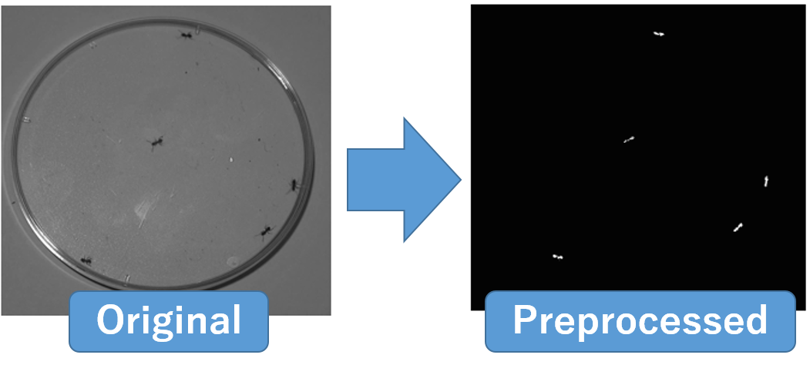
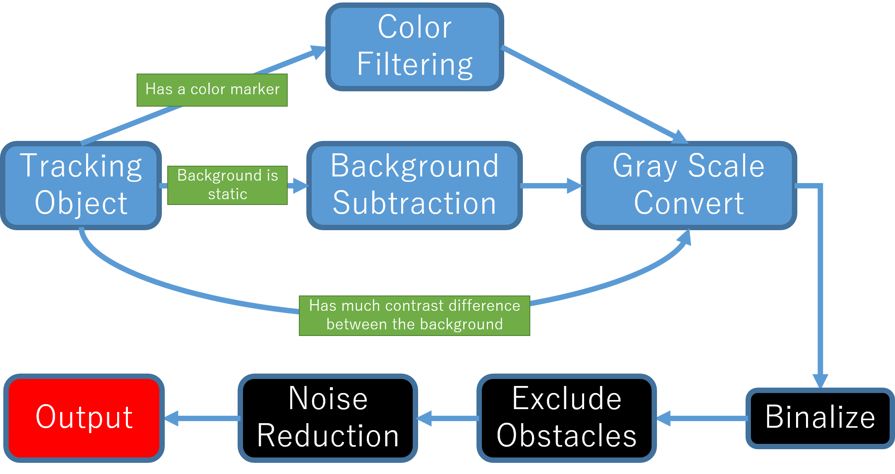
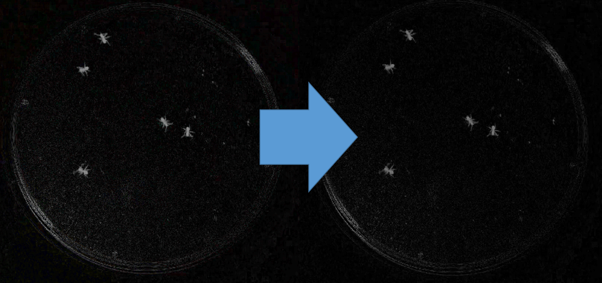

# UMATracker Quick Start Guide
## Summary
**UMATracker**は個体追跡，およびその結果の解析を提供するソフトウェア群である．

**UMATracker**は,

* **UMATracker-FilterGenerator**
* **UMATracker-Tracking**
* **UMATracker-TrackingCorrector**
* **UMATracker-Area51**

という4つのソフトウェアに別れており，各ソフトウェアを組み合わせることで動画の前処理・個体追跡・結果の修正・結果の解析を行うことが出来る．

### UMATracker Can Do
* ブロックの組み合わせによる解析動画の下処理（**UMATracker-FilterGenerator**）．
* 追跡対象の個体数が常に一定なビデオを使った個体追跡（**UMATracker-Tracking**）．
* 追跡対象の骨格・形状・向きの推定（**UMATracker-Tracking**）．
* 個体追跡結果の修正（**UMATracker-TrackingCorrector**）．
* Region-Of-Interest・個体間インタラクションなど，追跡結果の解析（**UMATracker-Area51**）．

### UMATracker Cannot Do (Currently)
* 追跡対象の個体数が増減するビデオをつかった個体追跡．
* **UMATracker-FilterGenerator**による前処理によって追跡対象を抽出できない場合の個体追跡．
```eval_rst
.. note:: 現状出来ないことに関しても，プラグインを作成・使用することで対応可能となっている．本件に関してはプラグイン作成マニュアルで別途触れる．
```

本Quick Start Guideでは個体追跡に絞って使用方法を解説する．

## Workflow


**UMATracker**による個体追跡は,

1. **UMATracker-FilterGenerator**で動画の下処理のためのフィルタを作成し，
2. **UMATracker-Tracking**において**UMATracker-FilterGenerator**で作成したフィルタを用いて個体追跡を行い，
3. **UMATracker-TrackingCorrector**を使って，**UMATracker-Tracking**で得られた個体追跡結果を修正し，
4. **UMATracker-Area51**をもちいて追跡結果の解析を行う

という流れになっている．

## UMATracker-FilterGenerator
個体追跡を行いたい動画に対して前処理として画像フィルタをかけて個体の位置を抽出することで，個体追跡の精度を高めることが出来る．
そこでまず**UMATracker-FilterGenerator**を使用し，ブロックを組み合わせることで画像フィルタを作成する．

### FilterGenerator Window
以下に**UMATracker-FilterGenerator**の画面各部の名称および説明を示す．


1. フィルタツールチップ
	
	利用出来るブロックの一覧が表示されるツールチップ．入力画像を変化させる画像フィルタが各ブロックに割り当てらており，
	ブロックを組み合わせることで個体を抽出するような画像フィルタを作成する．

2. フィルタブロック
	
	このブロックをドラッグ・アンド・ドロップし，ブロックをつなぎ合わせることで個体を抽出する画像フィルタを作成する．

3. キャンバス
	
	フィルタブロックを配置し，フィルタ群を作成する場所．

4. 入力画面
	
	入力動画が表示される．

5. 出力画面
	
	入力した動画に対してキャンバスに設置したフィルタを適応した結果が表示される．

6. Background生成メニュー
	
	入力動画の背景を抽出し，除去する．

### Filter Block Operation
上述のキャンバス上でブロックを組み合わせることで，画像フィルタを作成する．
本節ではブロックの操作方法について説明する．
#### Initial Block State


起動時には`Output`ブロックと`Input`ブロックのみがキャンバス上に表示される．
`Input`はソフトウェアに読み込ませた動画像のことを指しており，上述の『入力画面』に表示されている動画像のことである．

そして，`Output`ブロックに接続されたブロックのデータが上述の『出力画面』に表示される．
この例では`Input`ブロックが`Output`ブロックに直接接続されているので，`Input`ブロックのデータ，すなわち『入力画面』に表示された動画像が
『出力画面』に表示される．
`Input`ブロックと`Output`ブロックの間に各フィルタを意味するブロックを複数挟み込むことで画像フィルタを表現することが出来る．

#### Add Block
キャンバス上のブロック群へブロックを追加するには，フィルタツールチップからブロックをドラック＆ドロップすればよい．


```eval_rst
.. note:: ドラッグ＆ドロップではなく，フィルタツールチップ上でフォーカス中に右クリックすることでもフィルタを追加することができる．
```

たとえばフィルタツールチップ`Filters`内の`BGRToGray`を追加すると，『出力画面』が『入力画面』のグレースケールへ変化する．
このことから`BGRToGray`がグレースケールフィルタを意味していることがわかる．


このとき入出力は，

1. 『入力画面』に表示された動画像が`Input`ブロックを通して，
2. `BGRToGray`ブロックに入力される．このブロックが入力されたデータをグレースケール動画像へ変換し，
3. 変換後の動画像が`Output`ブロックに入力される．
4. そして，`Output`ブロックに入力された動画像が『出力画面』に反映される．

という流れとなっている．

#### Remove Block
不要になったブロックを削除するには，『フィルタツールチップ』もしくは『キャンバス』上のゴミ箱へブロックをドラッグ＆ドロップすれば良い．

```eval_rst
.. warning:: Outputブロックとブロックが離れている場合，使われていないブロックがある場合にはエラーとなり，出力が『出力画面』に反映されなくなる．

    .. list-table:: Error Examples
        :header-rows: 1

        * - Blocks
          - Description
        * - .. image:: img/quick/uma_filtergenerator_disconnectedoutputblock.png
          - ブロックとブロックが離れている場合．
        * - .. image:: img/quick/uma_filtergenerator_unusedblock.png
          - 使われていないブロックがある場合．
```

#### Block Types
ブロックは入力/出力があるかで3種類にわけることができる．

**入力/出力ブロックには画像フィルタが割り当てられており，入力ブロックからの動画像をフィルタで変換したものを出力する．**

```eval_rst
.. list-table:: Block I/O Types
    :header-rows: 1

    * - Block Example
      - Type
      - Description
    * - .. image:: img/quick/uma_filtergenerator_inputonlyblock.png
      - 入力ブロック
      - 入力のみを受け付けるブロック．
    * - .. image:: img/quick/uma_filtergenerator_inputoutputblock.png
      - 入力/出力ブロック
      - 入力と出力の両方をそなえたブロック．
    * - .. image:: img/quick/uma_filtergenerator_outputonlyblock.png
      - 出力ブロック
      - 出力のみをもつブロック．
```

### How to Make your own Filter

**UMATracker-FilterGenerator**では，個体追跡したい物体の場所が白くなるフィルタを作成することが目標である．上図ではアリのいた場所のみ白くなっていることがわかる．
そのためには

1. グレースケール変換
2. 二値化
3. 解析に不要な領域の除去
4. ノイズ除去

という手順をふむ必要がある．




#### Open the Video File
メニューより`Files/Open Video File`を選択，もしくはビデオファイルをウインドウにドラッグアンドドロップすることで解析に使用するビデオを読み込む．

```eval_rst
.. warning:: ファイルサイズが大きい（GB単位），もしくは長時間のビデオ（15分以上）を読み込むとソフトウェアの動作が遅くなる場合がある．そのような時はビデオを扱う場合は事前にエンコード・動画の分割を行うと解決される．
```

#### Generate Background


背景除去を行うには，メニューより`Background/Create Background`を選択しバックグラウンド生成ダイアログを表示する．


まず背景生成に使用するビデオの始点と終点を指定する．
スライダーを動かして，背景生成に使用する動画の始点を選び，Set Minボタンをクリックする．
すると，始点以降のスライダーバーの色が赤に変化する．
同様にスライダーを動かして，背景生成に使用する動画の終点を選び，Set Maxボタンをクリックすると
終点以前のスライダーバーの色が赤になる．
スライダーバーが赤色の部分のビデオが背景生成に使用される．
```eval_rst
.. note:: 正しく背景生成を行うためには，動画の背景が静的（コントラストや位置が変化しない）であることが必要である．背景生成に使用するビデオの始点と終点を指定することで，背景が安定しない撮影開始時・終了時など背景生成に使用したくない部分を除くことが出来る．
```

つぎに解析に使うビデオのフレーム間隔をFrame deltaで指定する．

以上を指定後Generateボタンを押すと背景生成が開始される．
背景生成終了後，結果がダイアログ右側のビューに背景除去された結果が反映されるので，スライダーを動かして背景除去に成功しているか確認する．

```eval_rst
.. warning:: 背景生成に使用するフレーム数が多ければ安定して背景生成できるが，処理に時間が掛かる．このようなときは生成に使用するビデオの始点と終点，Frame Deltaを調整する．
```


#### Color Filtering
カラーマーカーが付いている場合など追跡物体が特徴的な色を有している場合，その色を抽出するフィルタを作成することで追跡物体を抽出することができる．

```eval_rst
.. list-table:: ColorFilter
    :header-rows: 1

    * - Block
      - Description
    * - .. image:: img/quick/uma_filtergenerator_colorfilter.png
      - 右のカラーパレットで色を選択し左の類似度（数値）を調整することで色を選択する．
```

`Color Filter`は`Filters`ツールチップに含まれている．
ブロック左の赤色の部分をクリックするとカラーパレットがひらき，抽出したい色を選択することができる．
ブロック右の数値入力欄は色の類似度を表しており，選択した色とどの程度類似した色を抽出するか調整可能となっている．


```eval_rst
.. note:: ColorFilterブロックを選択後，『入力画面』上の抽出したい色の部分をクリックすることで色を選択することもできる．
```

```eval_rst
.. youtube:: https://www.youtube.com/watch?v=3ktUtdCrQzk
```

#### Convert to Gray Scale

個体追跡したい物体の場所のみが白くなるフィルタを作成するためには，その前にカラー画像を各ピクセルが0 - 255の値を持つグレースケール画像に変換する必要がある．
そこで`Filters`ツールチップに含まれる`BGRToGray`ブロックを用いて，カラー画像をグレースケール画像に変換する．

背景除去を行った後のアリの動画で`BGRToGray`ブロックを用いた例を示す．



```eval_rst
.. warning:: 例では見た目に変化はないが，必須の作業なので二値化の前に必ずおこなうこと．
```

#### Binalize


グレースケール画像は各ピクセルが0 - 255の値を持っており，0が黒をあらわし255に近い値であるほど白に近い値となっている．
前述のグレースケール変換では画像の追跡したい固体の部分が明るく抜き出されているので，その部分のみを白く抜き出せば最初の目標の画像に到達できることがわかる．

そこで，`Threshold`ブロックをもちいて二値化をおこなう．

ブロックの右側の数値入力欄が閾値をあらわしており，


#### Exclude the Obstacle by the Region Selector
#### Noise Reduction


#### Save Filter Data
メニューより`Files/Save Filter Data`を選択することでフィルタデータ（拡張子`.filter`）が保存される．
```eval_rst
.. warning:: Gray Scale変換・Binalizeを行っていない場合は個体追跡に失敗するので，保存前にGray Scale変換・Binalizeが行われていることを確認すること．
```