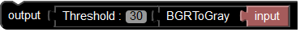
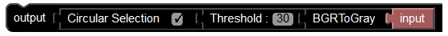
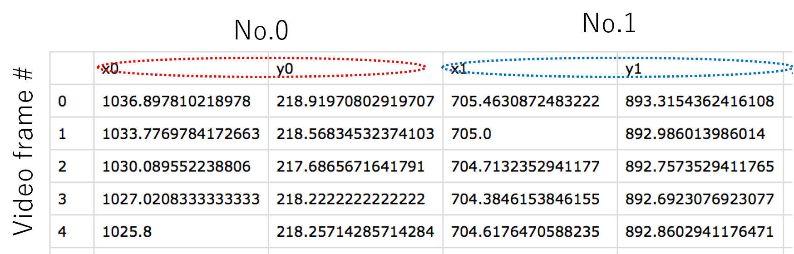
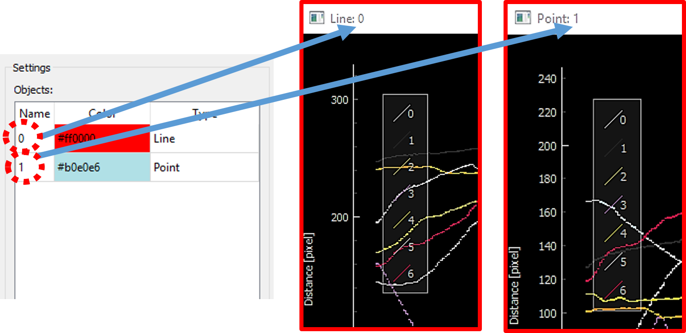

# UMATracker Quick Start Guide
## Summary
**UMATracker**は個体追跡，およびその結果の解析を提供するソフトウェア群である．

**UMATracker**は,

* **UMATracker-FilterGenerator**
* **UMATracker-Tracking**
* **UMATracker-TrackingCorrector**
* **UMATracker-Area51**

という4つのソフトウェアに別れており，各ソフトウェアを組み合わせることで動画の前処理・個体追跡・結果の修正・結果の解析を行うことが出来る．

### UMATracker Can Do
* ブロックの組み合わせによる解析動画の下処理（**UMATracker-FilterGenerator**）．
* 追跡対象の個体数が常に一定なビデオを使った個体追跡（**UMATracker-Tracking**）．
* 追跡対象の骨格・形状・向きの推定（**UMATracker-Tracking**）．
* 個体追跡結果の修正（**UMATracker-TrackingCorrector**）．
* Region-Of-Interest・個体間インタラクションなど，追跡結果の解析（**UMATracker-Area51**）．

### UMATracker Cannot Do (Currently)
* 追跡対象の個体数が増減するビデオをつかった個体追跡．
* **UMATracker-FilterGenerator**による前処理によって追跡対象を抽出できない場合の個体追跡．
```eval_rst
.. note:: 現状出来ないことに関しても，プラグインを作成・使用することで対応可能となっている．本件に関してはプラグイン作成マニュアルで別途触れる．
```

本Quick Start Guideでは個体追跡に絞って使用方法を解説する．

## Basic Workflow


**UMATracker**による個体追跡は,

1. **UMATracker-FilterGenerator**で動画の下処理のためのフィルタを作成し，
2. **UMATracker-Tracking**において**UMATracker-FilterGenerator**で作成したフィルタを用いて個体追跡を行い，
3. **UMATracker-TrackingCorrector**を使って，**UMATracker-Tracking**で得られた個体追跡結果を修正し，
4. **UMATracker-Area51**をもちいて追跡結果の解析を行う

という流れになっている．

## UMATracker-FilterGenerator
個体追跡を行いたい動画に対して前処理として画像フィルタをかけて個体の位置を抽出することで，個体追跡の精度を高めることが出来る．
そこでまず**UMATracker-FilterGenerator**を使用し，ブロックを組み合わせることで画像フィルタを作成する．

### FilterGenerator Window
以下に**UMATracker-FilterGenerator**の画面各部の名称および説明を示す．


1. フィルタツールチップ
	
	利用出来るブロックの一覧が表示されるツールチップ．入力画像を変化させる画像フィルタが各ブロックに割り当てらており，
	ブロックを組み合わせることで個体を抽出するような画像フィルタを作成する．

2. フィルタブロック
	
	このブロックをドラッグ・アンド・ドロップし，ブロックをつなぎ合わせることで個体を抽出する画像フィルタを作成する．

3. キャンバス
	
	フィルタブロックを配置し，フィルタ群を作成する場所．

4. 入力画面
	
	入力動画が表示される．

5. 出力画面
	
	入力した動画に対してキャンバスに設置したフィルタを適応した結果が表示される．

6. Background生成メニュー
	
	入力動画の背景を抽出し，除去する．

### Filter Block Operation
上述のキャンバス上でブロックを組み合わせることで，画像フィルタを作成する．
本節ではブロックの操作方法について説明する．
#### Initial Block State


起動時には`Output`ブロックと`Input`ブロックのみがキャンバス上に表示される．
`Input`はソフトウェアに読み込ませた動画像のことを指しており，上述の『入力画面』に表示されている動画像のことである．

そして，`Output`ブロックに接続されたブロックのデータが上述の『出力画面』に表示される．
これらの`Input`ブロックと`Output`ブロックの間に各フィルタを意味するブロックを複数挟み込むことで画像フィルタを表現することが出来る．
この例では`Input`ブロックが`Output`ブロックに直接接続されているので，`Input`ブロックのデータ，すなわち『入力画面』に表示された動画像が
そのまま『出力画面』に表示される．

#### Add Block
キャンバス上のブロック群へブロックを追加するには，フィルタツールチップからブロックをドラック＆ドロップすればよい．


```eval_rst
.. note:: ドラッグ＆ドロップではなく，フィルタツールチップ上でフォーカス中に右クリックすることでもフィルタを追加することができる．
```

たとえばフィルタツールチップ`Filters`内の`BGRToGray`を追加すると，『出力画面』が『入力画面』のグレースケールへ変化する．
このことから`BGRToGray`がグレースケールフィルタを意味していることがわかる．


このとき入出力は，

1. 『入力画面』に表示された動画像が`Input`ブロックを通して，
2. `BGRToGray`ブロックに入力される．このブロックが入力されたデータをグレースケール動画像へ変換し，
3. 変換後の動画像が`Output`ブロックに入力される．
4. そして，`Output`ブロックに入力された動画像が『出力画面』に反映される．

という流れとなっている．

#### Remove Block
不要になったブロックを削除するには，『フィルタツールチップ』もしくは『キャンバス』上のゴミ箱へブロックをドラッグ＆ドロップすれば良い．

```eval_rst
.. warning:: Outputブロックとブロックが離れている場合，使われていないブロックがある場合にはエラーとなり，出力が『出力画面』に反映されなくなる．

    .. list-table:: Error Examples
        :header-rows: 1

        * - Blocks
          - Description
        * - .. image:: img/quick/uma_filtergenerator_disconnectedoutputblock.png
          - ブロックとブロックが離れている場合．
        * - .. image:: img/quick/uma_filtergenerator_unusedblock.png
          - 使われていないブロックがある場合．
```

#### Block Types
ブロックは入力/出力があるかで3種類にわけることができる．

**入力/出力ブロックには画像フィルタが割り当てられており，入力ブロックからの動画像をフィルタで変換したものを出力する．**

```eval_rst
.. list-table:: Block I/O Types
    :header-rows: 1

    * - Block Example
      - Type
      - Description
    * - .. image:: img/quick/uma_filtergenerator_inputonlyblock.png
      - 入力ブロック
      - 入力のみを受け付けるブロック．
    * - .. image:: img/quick/uma_filtergenerator_inputoutputblock.png
      - 入力/出力ブロック
      - 入力と出力の両方をそなえたブロック．
    * - .. image:: img/quick/uma_filtergenerator_outputonlyblock.png
      - 出力ブロック
      - 出力のみをもつブロック．
```

### How to Make your own Filter

**UMATracker-FilterGenerator**では，個体追跡したい物体の場所が白くなるフィルタを作成することが目標である．上図ではアリのいた場所のみ白くなっていることがわかる．
そのためには

1. グレースケール変換
2. 二値化
3. 解析に不要な領域の除去
4. ノイズ除去

という手順をふむ必要がある．

追跡物体が背景と十分なコントラスト差をもっているときはこの手順で十分個体追跡が可能だが，そうでない場合は前段階として

1. 背景の除去
2. 色選択による追跡物体の抽出

のいずれかをおこなうことで精度よく個体追跡が出来るようになる．


```eval_rst
.. youtube:: https://www.youtube.com/watch?v=PEWX8cctaSQ
```

#### Open the Video File
メニューより`Files/Open Video File`を選択，もしくはビデオファイルをウインドウにドラッグアンドドロップすることで解析に使用するビデオを読み込む．

```eval_rst
.. warning:: ファイルサイズが大きい（GB単位），もしくは長時間のビデオ（15分以上）を読み込むとソフトウェアの動作が遅くなる場合がある．そのような時はビデオを扱う場合は事前にエンコード・動画の分割を行うと解決される．
```

#### Generate Background


背景除去を行うには，メニューより`Background/Create Background`を選択しバックグラウンド生成ダイアログを表示する．


まず背景生成に使用するビデオの始点と終点を指定する．
スライダーを動かして，背景生成に使用する動画の始点を選び，Set Minボタンをクリックする．
すると，始点以降のスライダーバーの色が赤に変化する．
同様にスライダーを動かして，背景生成に使用する動画の終点を選び，Set Maxボタンをクリックすると
終点以前のスライダーバーの色が赤になる．
スライダーバーが赤色の部分のビデオが背景生成に使用される．
```eval_rst
.. note:: 正しく背景生成を行うためには，動画の背景が静的（コントラストや位置が変化しない）であることが必要である．背景生成に使用するビデオの始点と終点を指定することで，背景が安定しない撮影開始時・終了時など背景生成に使用したくない部分を除くことが出来る．
```

つぎに解析に使うビデオのフレーム間隔をFrame deltaで指定する．

以上を指定後Generateボタンを押すと背景生成が開始される．
背景生成終了後，結果がダイアログ右側のビューに背景除去された結果が反映されるので，スライダーを動かして背景除去に成功しているか確認する．

```eval_rst
.. warning:: 背景生成に使用するフレーム数が多ければ安定して背景生成できるが，処理に時間が掛かる．このようなときは生成に使用するビデオの始点と終点，Frame Deltaを調整する．
```


```eval_rst
.. youtube:: https://www.youtube.com/watch?v=za1jzU0K56k
```

#### Color Filtering
カラーマーカーが付いている場合など追跡物体が特徴的な色を有している場合，その色を抽出するフィルタを作成することで追跡物体を抽出することができる．

```eval_rst
.. list-table:: ColorFilter
    :header-rows: 1

    * - Block
      - Description
    * - .. image:: img/quick/uma_filtergenerator_colorfilter.png
      - 右のカラーパレットで色を選択し左の類似度（数値）を調整することで色を選択する．
```

`Color Filter`は`Filters`ツールチップに含まれている．
ブロック左の赤色の部分をクリックするとカラーパレットがひらき，抽出したい色を選択することができる．
ブロック右の数値入力欄は色の類似度を表しており，選択した色とどの程度類似した色を抽出するか調整可能となっている．


```eval_rst
.. note:: ColorFilterブロックを選択後，『入力画面』上の抽出したい色の部分をクリックすることで色を選択することもできる．
```

```eval_rst
.. youtube:: https://www.youtube.com/watch?v=3ktUtdCrQzk
```

#### Convert to Gray Scale

個体追跡したい物体の場所のみが白くなるフィルタを作成するためには，その前にカラー画像を各ピクセルが0 - 255の値を持つグレースケール画像に変換する必要がある．
そこで`Filters`ツールチップに含まれる`BGRToGray`ブロックを用いて，カラー画像をグレースケール画像に変換する．

背景除去を行った後のアリの動画で`BGRToGray`ブロックを用いた例を示す．


```eval_rst
.. warning:: 例では見た目に変化はないが，必須の作業なので二値化の前に必ずおこなうこと．
```

#### Binarize


グレースケール画像は各ピクセルが0 - 255の値を持っており，値0が黒をあらわし255に近い値であるほどそのピクセルは白に近い色となる．
前述のグレースケール変換では画像の追跡したい固体の部分が明るく抜き出されているので，その部分のみを白く抜き出せば最初の目標の画像に到達できる．

そこで，`Threshold`ブロックをもちいて二値化をおこなう．
二値化とは，グレースケール画像を白と黒の2階調画像に変換することであり，ある閾値を定めて，各ピクセルの値がその閾値を上回っているとき255（白），そうでないときは0（黒）にそのピクセルの値を変換する画像フィルタである．

`Threshold`ブロックの右側の数値入力欄が閾値をあらわしている．

前述でグレースケール変換を行ったアリの動画で`Threshold`ブロックを用いた例を示す．




#### Exclude the Obstacle by the Region Selector

解析に不要な領域が個体追跡の精度に悪影響を及ぼすことがある．
そこで範囲選択をおこなうことで，解析に不要な領域を除去する必要がある．

`UMATracker-FilterGenerator`は矩形による選択`Rectangle selection`ブロック・楕円による選択`Circular selection`ブロック・任意の4頂点での範囲選択`Poly Selection`ブロックを有している．

```eval_rst
.. list-table:: Selection/Exclusion Blocks
    :header-rows: 1
    :widths: 2, 1, 5

    * - Block Example
      - Type
      - Description
    * - .. image:: img/quick/uma_filtergenerator_rectsel.png
      - 矩形
      - .. image:: img/quick/uma_filtergenerator_rectselexample.png
    * - .. image:: img/quick/uma_filtergenerator_circsel.png
      - 楕円
      - .. image:: img/quick/uma_filtergenerator_circselexample.png
    * - .. image:: img/quick/uma_filtergenerator_polysel.png
      - 4頂点
      - .. image:: img/quick/uma_filtergenerator_polyselexample.png
```

前述で二値化を行ったアリの動画で`Circular selection`ブロックを用いた例を示す．
前段階ではシャーレの縁が写っていたが，`Circular selection`ブロックを用いることでシャーレ内のみを抜き出すことに成功している．




```eval_rst
.. youtube:: https://www.youtube.com/watch?v=NRFRUSzR6xk
```

```eval_rst
.. youtube:: https://www.youtube.com/watch?v=fqht_bxmx3s
```

```eval_rst
.. note:: 各ブロックのチェックボックスをオフにすると，切り取られる領域が反転する．
```

#### Noise Reduction
動画ファイルにはノイズが必ず含まれる．ノイズの原因は，観察者の移動などで発生する照度の微妙な変化・実験環境に含まれる微妙なチリ・動物の糞など様々である．これらのノイズを極力排除することで，精度良く個体追跡をおこなえる．

最も簡単なノイズ除去は`Erosion`ブロックを使うことである．
Erosionは白色の領域を縮めるようなフィルタのことで，これを用いることで追跡物体よりも小さいノイズを除去することができる．


前述の不要な領域の除去を行ったアリの動画で`Erosion`ブロックを用いた例を示す．


#### Save Filter Data
メニューより`Files/Save Filter Data`を選択することでフィルタデータ（拡張子`.filter`）が保存される．
```eval_rst
.. warning:: Gray Scale変換・Binarizeを行っていない場合は個体追跡に失敗するので，保存前にGray Scale変換・Binarizeが行われていることを確認すること．
```

## UMATracker-Tracking

### Tracking Window

以下に**UMATracker-Tracking**の画面各部の名称および説明を示す．


1. 個体追跡結果画面
    
    入力動画と個体追跡結果を表示する．

2. 個体追跡パラメタ設定画面
    
    個体数など，トラッキングで使用する値を変更する．設定可能なパラメタはトラッキングアルゴリズムより異なる．
    ここではデフォルトで使用されるGroupTracker GMMの設定画面を例に説明する．
    
	
	
	1. \#of objects
		
		追跡物体の個数を入力する．
	
	2. \#of k-means
		
    	事前クラスタリングにおけるクラスタ数．通常は１の追跡物体数と同じ値を指定する．
	
	3. Likelihood diff. threshold
		
    	前フレームでの個体追跡結果との類似度の閾値を表す．閾値をこえた場合はそれまで推定に用いてきた特徴情報を捨てて，新たに特徴情報を取得する．
	
	4. Restart from this frame
		
    	追跡ミスを修正したあとに押すボタン．ボタンが押すと，修正を反映して現在のビデオ再生位置から個体追跡をやり直すことができる．
	
	5. Set/Reset
		
    	上記で設定したパラメタを適用して新たに個体追跡を開始するボタン．パラメタ変更後や個体追跡をやり直したいときに押すと，ビデオが開始位置に巻き戻される．これまでの追跡結果は破棄される．

3. 結果表示設定画面
    
    個体追跡結果の表示の詳細を設定する項目．
    * Radius
        
        結果画面に表示される個体位置を表す点の大きさを設定する．
    
    * Line Width
        
        結果画面に表示される個体の移動した軌跡の太さを設定する．
    
    * \# of overlay
        
        前後何フレーム分の軌跡を結果画面に表示するかを設定する．

4. トラッキングアルゴリズム選択メニュー
    
    **UMATracker-Tracking**には複数の個体追跡アルゴリズムが搭載されており，それをトラッキングアルゴリズム選択メニューから
    選択することができる．

5. Filesメニュー
    
    動画・フィルタの読み込み，トラッキング結果の保存をおこなう．

### Load the Video and its Filter data
個体追跡を行うには，はじめに解析対象の動画と前述の**UMATracker-FilterGenerator**で作成したフィルタデータをドラッグ&ドロップで読み込む．


### Set Tracking Parameter


つぎに個体追跡に必要なパラメタを個体追跡パラメタ設定画面で設定する．
デフォルトで使用されるGroupTracker GMMでは追跡物体数(`# of objects`)を指定し，`Set/Reset`ボタンを押すと，個体追跡結果画面に個体位置を示す円と個体番号が表示される．

### Execute Object Tracking
初期状態で正しく追跡物体位置が推定されているのを確認したあとビデオの再生を開始すると，ビデオの再生に併せて個体追跡が実行される．

```eval_rst
.. note:: Run/Run Object Trackingメニューにより，ビデオの再生なしに個体追跡をおこなうこともできる．
```

### Fix Mis-Detection
ノイズなどの影響により，正しく個体追跡が行われなかったりエラーメッセージが出たりして個体追跡が破綻してしまうことがある．そのようなときは，破綻がおこったビデオ再生位置までビデオを巻き戻し，個体追跡結果画面の追跡結果をドラッグアンドドロップで修正する．そして`Restart from this frame`ボタンを押すことで修正後の状態から個体追跡を再開することができる．

```eval_rst
.. note:: 追跡個体の入れ替わりや追跡結果のずれなど個体追跡が破綻していない場合は，次節のTrackingCorrectrで修正可能なので個体追跡中に修正を行う必要はない．
```

```eval_rst
.. note:: 全ての個体追跡の破綻に対応することができるわけではない．そのような場合は，前節で作成したフィルタを修正する必要がある．
```

### Save Tracking Data
`Files/Save Data`メニューより，個体追跡によって得られた座標データを保存することができる．

1. ビデオの情報
	
    FPSなど，読み込まれたビデオの詳細情報がテキストファイルとして保存される．

2. 個体追跡結果
	
	保存される追跡結果は個体追跡アルゴリズムに依存する．GroupTracker GMMでは個体追跡結果のデータが，ビデオフレーム番号を行・各個体の座標を列に持つCSVとして保存される．追跡結果表示画面に表示されている個体番号の順に各個体の座標が並ぶようになっている．
	

## UMATracker-TrackingCorrector
個体追跡において多くの場合で追跡ミスが起こるため，正しい追跡結果を得るためには追跡ミスの修正行程が必要になる．**UMATracker-TrackingCorrector**を使うことで，追跡ミスの修正を簡単に行うことができる．

### TrackingCorrector Window
以下に**UMATracker-TrackingCorrector**の画面各部の名称および説明を示す．


1. 個体追跡結果表示画面
	
    個体追跡結果を表示する画面．結果表示画面上で範囲選択することで，範囲選択された部分が右側の追跡結果画面に拡大表示される．

2. 追跡結果拡大画面
	結果表示画面において範囲選択された部分が拡大表示される．追跡結果を表す円を右クリックすると円が四角形に変化し，その個体の追跡データが選択状態になる．2個体の追跡データを選択状態にすると`Swap`ボタンが現れる．`Swap`ボタンをクリックすると，現在のビデオ再生位置以降の2つの個体の追跡データが入れ替わる．

3. 結果表示設定画面
    
    個体追跡結果の表示の詳細を設定する項目．
    * Path Length
        
        前後何フレーム分の軌跡を結果画面に表示するかを設定する．
    * Radius
        
        結果画面に表示される個体位置を表す点の大きさを設定する．
    
    * Mark Interval
        
        目印の間隔の大きさを設定する．
        各個体の追跡結果の軌跡に対して，ここで指定された間隔毎に黒点がうたれる．

4. Change the Order of Individual Numbers
	
    各個体に割り当てられている番号を入れ替えるための番号．
    このメニューをクリックするとダイアログが表示され，入れ替えたい個体番号を指定し`Swap`ボタンを押すと個体番号が入れ替わる．
    


### Data Correction

つぎに実際の修正工程について説明する．
まずは，解析対象のビデオと前述の**UMATracker-Tracking**によって得られた追跡データを
ドラッグアンドドロップで**UMATracker-TrackingCorrector**に読み込ませる．
つぎに，軌跡の変化を把握しやすくするため`Path Length`など表示の調整項目を調整し，
再生しながら目視で追跡ミスを探す．

#### Zoom Up

拡大機能を用いることで，追跡ミスが起きていそうなところを詳細に見ることができる．
左側の結果表示画面でドラッグアンドドロップにより範囲選択を行うと，右側の拡大画面に範囲選択した領域が拡大表示される．


#### Fix the Position Aberration

追跡ミスを見つけたら，右側の拡大画面でマーカーをドラッグアンドドロップすることで修正することができる．


#### Correct the Data Swapping

入れ替わりを見つけたら，入れ替わりが起こったビデオの再生位置を探す．
入れ替わりが起こった再生位置を見つけたら，右側の拡大画面において入れ替わった2個体のマーカーをそれぞれ右クリックで選択する．
すると`Swap`メニューが表示されるので，それをクリックすると入れ替わりが解消される．


#### Save Data

修正が完了したら，`Files/Save Data`メニューを選択して修正結果を保存する．

## UMATracker-Area51

**UMATracker-Area51**を使うことで，個体追跡結果を解析することができる．
具体的には，解析に使用したビデオの画面上に領域・直線・点といったオブジェクトを配置することで
解析を行う．

* 領域オブジェクト
	
	直線領域を配置することにより，各個体からこの直線オブジェクトへの距離を算出することができる．
    たとえば下図において，領域１（青）・領域２（赤）という二つの領域をビデオ上に配置する（左図）ことで，
    各個体がいた領域の時間変化をダイアグラムとしてプロットすることができる（右図）．
    

* 直線オブジェクト
	
	直線オブジェクトを配置することにより，各個体からこの直線オブジェクトへの距離を算出することができる．
    たとえば下図において，赤い直線をビデオ上に配置する（左図）ことで，各個体から赤い直線への距離の時間変化を
    プロットすることができる（右図）．
    

* 点オブジェクト
	点オブジェクトを配置することにより，各個体からこの点オブジェクトへの距離を算出することができる．
    たとえば下図において，赤い点をビデオ上に配置する（左図）ことで，各個体から赤い点への距離の時間変化を
    プロットすることができる（右図）．
    

また，**UMATracker-Area51**では個体間距離を基準とした個体間インタラクション解析を行うこともできる．


### Area51 Window

以下に**UMATracker-Area51**の画面各部の名称および説明をしめす．


1. 個体追跡結果/オブジェクト表示画面
    
    入力動画と個体追跡結果，およびユーザーによって追加されたオブジェクトを表示する．

2. オブジェクトリストテーブル
    
    オブジェクトの固有名・色・種類を設定する画面．
    
    * Name列
    	
        行に対応するオブジェクトの名称を表示する．
        この列の要素をダブルクリックするとプルダウンメニューが表示され，ダブルクリックした要素の行に対応するオブジェクトの名称を変更できる．
    
    * Color列
    	
        行に対応するオブジェクトの表示色を表示する．
        この列の要素をダブルクリックするとプルダウンメニューが表示され，ダブルクリックした要素の行に対応するオブジェクトの表示色を変更できる．
    
    * Type列
    	
        行に対応するオブジェクトのタイプを表示する．
        この列の要素をダブルクリックするとプルダウンメニューが表示され，ダブルクリックした要素の行に対応するオブジェクトの種類を変更できる．

3. オブジェクト追加/削除/優先順位変更ボタン
    
    * +/- Button
    	
        オブジェクトを追加/削除するためのボタン．
    * Up/Down 矢印ボタン
    	
        オブジェクトの優先順位の入れ替えを行う．オブジェクトの優先順位に関しては後述する．

4. Radiusパラメタ入力ボックス
    
    結果表示画面に表示された各個体を表す円マーカーの半径を設定する入力ボックス．
    この値は個体間インタラクションを算出するときに用いられる（後述）．

### Load the Video and Tracking Result

解析に使用するビデオとその個体追跡結果データを，メインウインドウにドラックアンドドロップして読み込ませる．

### Add and Select Object

次に，解析に使用するオブジェクトを追加する．
画面右下の+ Buttonを押すとオブジェクトリストテーブルにオブジェクトが追加される．

オブジェクトの種類は，Region of Interest Object TypeとDistance Calculation Object Typeの2つのグループに分けることができる．
以下の通りRegion of Interest Object Typeのオブジェクトは3種類，Distance Calculation Object Typeのオブジェクトは2種類存在する．

1. Region of Interest Object Type
	
	* Rectangular Object
	* Ellipse Object
	* Polygon Object

2. Disntance Calculation Object Type
	
	* Point Object
	* Line Object

オブジェクトリストテーブルに表示されたオブジェクト行のType列をダブルクリックすると，プルダウンメニューが表示されてオブジェクトを変更することが出来る．


### Data Analysis Settings

Region of Interests Object Typeのオブジェクトを用いたRegion of Interests Analysisと，Distance Calculation Object Typeのオブジェクトを用いたDistance from the Point/Line Analysisの二種類の解析を行うことが出来る．以下，それぞれの解析手法に関して操作手順を説明する．

#### Region of Interests Analysis


#### Distance from the Point/Line Analysis

四角マークをドラッグアンドドロップすることで，各オブジェクトの位置や

`Run/Calculate`メニューを選択することで，配置されたそれぞれのオブジェクトから各個体への距離を算出することができる．
各オブジェクトごとにウィンドウが表示され，各オブジェクトに対して算出されたデータがLine Plotとして表示される．

1. Point Object
	
    このオブジェクトを選択すると，個体追跡結果/オブジェクト表示画面に四角の点が表示される．
    四角の点をドラッグアンドドロップすることで，このオブジェクトの位置を変更できる．
    
    `Run/Calculate`メニューを選択すると，このオブジェクトと各個体間の距離が算出される．

2. Line Object
	
    このオブジェクトを選択すると，個体追跡結果/オブジェクト表示画面に直線が表示される．
    オブジェクトの両端に表示された端点をドラッグアンドドロップすることで直線の端の位置を変更できる．
    また，表示された直線をドラッグアンドドロップすることで直線全体の位置を変更できる．
    
    `Run/Calculate`メニューを選択すると，配置されたLine Objectから各個体への最短距離が算出される．
    2次元空間上の座標を(x, y)であらわし，そこに配置されたLine Objectをあらわす直線の式をax + by + c = 0であるとする．このとき，各固体の位置(x_i, y_i)から直線への最短距離は|ax_i + by_i +c|/\sqrt{a^2 + b^2}となる．

解析結果は横軸がビデオフレーム番号，縦軸がオブジェクトからの距離のLine Plotで表示される．
解析結果を表示するウインドウの名称は，解析対象オブジェクトの名称が表示される．


